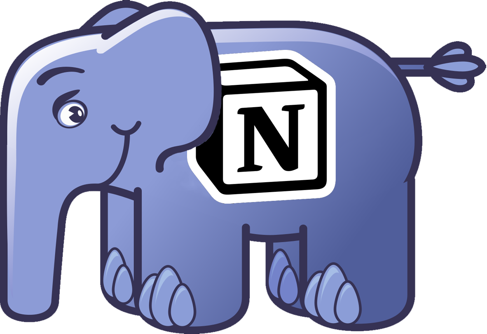

<p align="center">
    
</p>

<p align="center">
    <a href="https://app.codecov.io/gh/mariosimao/notion-sdk-php">
        <image src="https://img.shields.io/codecov/c/github/mariosimao/notion-sdk-php?token=ZKKCWDY4QX">
    </a>
    <a href="https://shepherd.dev/github/mariosimao/notion-sdk">
        <image src="https://shepherd.dev/github/mariosimao/notion-sdk/coverage.svg">
    </a>
    <a href="https://developers.notion.com/reference/versioning">
        <image src="https://img.shields.io/badge/API%20Version-2022--06--28-%23212121">
    </a>
    <a href="https://packagist.org/packages/mariosimao/notion-sdk-php">
        <image src="https://img.shields.io/packagist/php-v/mariosimao/notion-sdk-php?color=%23787CB5">
    </a>
    <a href="https://packagist.org/packages/mariosimao/notion-sdk-php">
        <image src="https://img.shields.io/packagist/dt/mariosimao/notion-sdk-php?color=%23FF8A65">
    </a>
</p>

# notion-sdk-php

A complete Notion SDK for PHP developers.

## Installation

```
composer require mariosimao/notion-sdk-php
```

## Documentation

Further documentation can be found [here](https://mario.engineering/notion-sdk-php).
