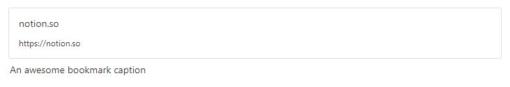

# Bookmark block

## Create

Creating a bookmark from a URL string:
```php
<?php

$bookmark = Bookmark::create("https://notion.so");
```


## Add caption

```php
$caption = RichText::createText("An awesome bookmark caption");

$bookmark = Bookmark::create("https://notion.so")
                    ->withCaption($caption);
```



## Change URL

```php
$bookmark = Bookmark::create("https://notion.so");

$bookmark = $bookmark->withUrl("https://google.com");
```