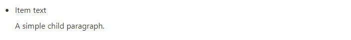
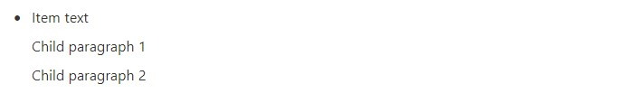

# Bulleted list item

## Create empty item

```php
$item = BulletedListItem::create();
```

## Create from string

Bulleted list items can be created from simple strings.

```php
$item = BulletedListItem::fromString("Item content");
```


## Create from `RichText`

```php
$text = RichText::createText("Item text")->italic();

$item = BulletedListItem::create()->changeText($text);
```


## Add text

```php
$item = BulletedListItem::fromString("Item text");
$item = $item->addText(
    RichText::createText(" can be extended!")
);

echo $item->toString();
```

Output:
```
Item text can be extended!
```
## Add child

```php
$item = BulletedListItem::fromString("Item text");

$item = $item->addChild(
    Paragraph::fromString("A simple child paragraph.")
);
```



## Change children

```php
$item = BulletedListItem::fromString("Item text")
    ->addChild(Paragraph::fromString("Old child"));

$item = $item->changeChildren(
    Paragraph::fromString("Child paragraph 1"),
    Paragraph::fromString("Child paragraph 2"),
);
```



## Convert to string

Get item content as string

```php
$item = BulletedListItem::fromString("Item text");

echo $item->toString();
```

Output:

```
Item text
```