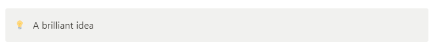
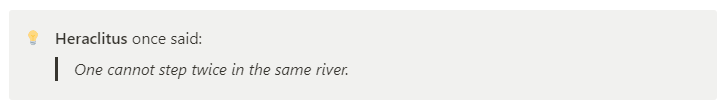

# Callout

## Create

Creating an empty callout:

```php
$block = Callout::create();
```


## Create from string

```php
$block = Callout::fromString("💡", "A brilliant idea");
```



## Create from `RichText`

```php
$block = Callout::create()->changeText(
    RichText::createText("Rich text ")->italic(),
    RichText::createText("is")->underline(),
    RichText::createText(" amazing")->bold(),
);
```


## Convert to string

```php
$block = Callout::fromString("💡", "A brilliant idea");

echo $block->toString();
```

Output:
```
A brilliant idea
```

## Change text

```php
$block = Callout::fromString("💡", "Old text");

$block = $block->changeText(
    RichText::createText("New text"),
);

echo $block->toString();
```

Output:

```
New text
```

## Add text

```php
$block = Callout::fromString("💡", "ABC")
    ->addText(RichText::createText("123"));

echo $block->toString();
```

Output:

```
ABC123
```

## Change icon

### Emoji

```php
$block = Callout::fromString("😎", "A brilliant idea");

$newIcon = Emoji::create("💡");
$block = $block->changeIcon($newIcon);

echo $block->icon->emoji->emoji;
```

Output:
```
💡
```

### File

```php
$block = Callout::fromString("😎", "A brilliant idea");

$newIcon = File::createExternal(
    "https://cdn-icons-png.flaticon.com/512/648/648675.png"
);
$block = $block->changeIcon($newIcon);

echo $block->icon->file->url;
```

Output:
```
https://cdn-icons-png.flaticon.com/512/648/648675.png
```

## Add child

```php
$block = Callout::create()
    ->chageIcon(Emoji::create("💡"))
    ->changeText(
        RichText::createText("Heraclitus")->bold(),
        RichText::createText(" once said:"),
    )->addChild(
        Quote::fromString("One cannot step twice in the same river")
    );
```



## Change children

```php
$block = Callout::fromString("💡", "A brilliant idea")
    ->addChild(
        Paragraph::fromString("Old paragraph")
    );

$block = $block->changeChildren(
    Paragraph::fromString("New paragraph 1"),
    Paragraph::fromString("New paragraph 2"),
);

echo $block->children[0]->toString() . PHP_EOL;
echo $block->children[1]->toString() . PHP_EOL;
```

Output:
```
New paragraph 1
New paragraph 2
```
