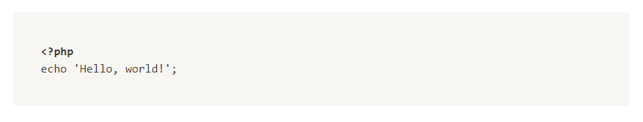
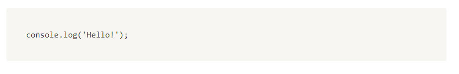

# Code

## Create empty

Creating an empty code block:

```php
$block = Code::create();
```

## Create from string

```php
$text = "<?php echo 'Hello, world!';";
$block = Code::createFromString($text, CodeLanguage::Php);
```



## Create from `RichText`

```php
$text = [
    RichText::fromString("<?php\n"),
    RichText::fromString("echo 'Hello, world!';"),
];
$block = Code::create($text, CodeLanguage::Php);
```


## Change language

```php
$block = Code::createFromString("console.log('Hello!');")->changeLanguage(CodeLanguage::Javascript);
```



## Append text

```php
$block = Code::create()
    ->addText(RichText::fromString("console.log('Hello!')"))
    ->changeLanguage(CodeLangugae::Javascript);
```

## Change text

```php
$text = [
    RichText::fromString("<?php\n"),
    RichText::fromString("echo 'Hello, world!';"),
];

$block = Code::create()
    ->changeText(...$text)
    ->changeLanguage(CodeLanguage::Php);
```