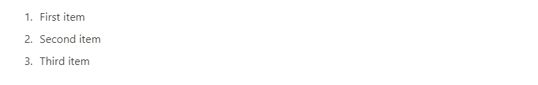

# Numbered list item

List with numbering.

## Create from string

```php
$blocks = [
    NumberedListItem::fromString("First item"),
    NumberedListItem::fromString("Second item"),
    NumberedListItem::fromString("Third item"),
];
```



